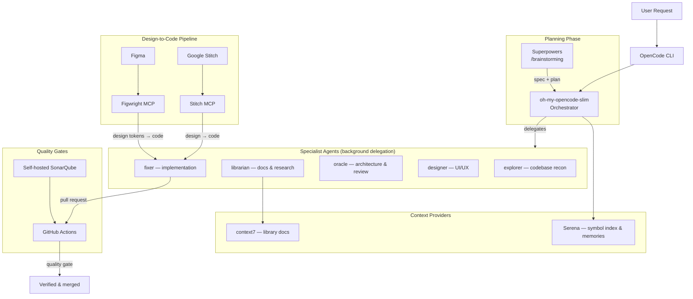

# AI-Assisted Coding Workflow

This repo documents my AI-assisted software development workflow, built on the [OpenCode](https://opencode.ai) CLI. It covers the orchestration layer, context and memory tooling, design-to-code pipelines, planning skills, and quality gates.

The architecture has evolved — the v1 "Team Leader" agent pattern is archived in [`old-agents/README.md`](old-agents/README.md) as the previous architecture; this README describes the current setup.

## Architecture

## Core Stack

| Tool | Purpose | Role in the flow |
|------|---------|------------------|
| **OpenCode CLI** | Terminal AI coding assistant | Hosts agents, skills, MCPs, and providers |
| **oh-my-opencode-slim** | Agent orchestration plugin for OpenCode | Routes tasks to specialist agents; runs on the `opencode-go` preset |
| **Superpowers** | Skills suite (planning, TDD, debugging, review) | `/brainstorming` and related skills for feature work and complex tasks |
| **Serena** (MCP) | Project symbol index + persistent memories | Agents understand a repo without reading everything; `.serena/` per project |
| **Stitch MCP** | Google Stitch design tool | Translates designs in Stitch into code |
| **Figwright MCP** | Figma design tool bridge | Translates Figma designs into code; design-system-aware |
| **context7** (MCP) | Version-specific library documentation | Injects current docs into the context window at query time |
| **SonarQube** (self-hosted) | Code quality & security analysis | Quality gate via GitHub Actions on pull requests |

> **Also in my stack (not covered in detail here):** `rtk` (token-optimizing bash proxy/plugin), `headroom` (local model proxy), `9router` (local model gateway), `oMLX` (local MLX provider), `graphify` (knowledge-graph skill), `azure-*` skills, and a per-project `aws` MCP.

## The End-to-End Flow

How a feature goes from request to merged code:

1. **Request** — a task comes in through OpenCode (direct or via a skill invocation).
2. **Plan** — for feature work, `/brainstorming` (superpowers) clarifies intent, requirements, and architecture into a spec. For straightforward changes, planning is lighter.
3. **Delegate** — the orchestrator routes work to specialists, dispatching independent lanes in the background and tracking task ownership.
4. **Execute** — specialists do the work: explorer scouts code, librarian fetches docs, designer handles UI/UX, fixer implements bounded tasks.
5. **Reconcile** — the orchestrator merges specialist outputs, resolves conflicts, and gates dependent lanes.
6. **Verify** — quality gates run (SonarQube via GitHub Actions); the orchestrator confirms the work meets requirements.
7. **Report** — a summary of what was done, what's pending, and any blockers.

## Orchestration

[oh-my-opencode-slim](https://github.com/alvinunreal/oh-my-opencode-slim) provides the agent roster under a central **orchestrator** that plans, delegates, and reconciles instead of doing all the work itself.

| Agent | Role |
|-------|------|
| **orchestrator** | Default lead; plans the dependency graph, dispatches background specialists, reconciles results |
| **explorer** | Fast codebase reconnaissance — locates files, symbols, and patterns |
| **librarian** | External knowledge — library docs, API references, GitHub examples (uses context7 + gh_grep) |
| **oracle** | Strategic advisor — architecture, complex debugging, code review |
| **designer** | UI/UX design and implementation |
| **fixer** | Bounded implementation — executes well-scoped tasks |
| **observer** | Visual analysis of images/PDFs/screenshots (read-only) |

Agents can be invoked directly with `@agentName <task>`. Model routing is handled by presets — the current preset is **`opencode-go`**, backed by the [OpenCode Go](https://opencode.ai/docs/go/) subscription (flat $10/month, usage caps of $12/5h, $30/week, $60/month).

## Planning & Skills

- **Superpowers** — the skill suite used for feature work and complex tasks:
  - `/brainstorming` — requirement clarification and design before implementation
  - `writing-plans` / `executing-plans` — spec-driven, review-gated implementation
  - `test-driven-development`, `systematic-debugging`, `requesting/receiving-code-review`, `verification-before-completion`, and more
- **oh-my-opencode-slim skills** — `codemap`, `deepwork`, `simplify`, `verification-planning`, `worktrees`, `clonedeps`, `reflect`

## Design-to-Code Pipeline

Designs are translated to code through MCP bridges, with design systems kept authoritative:

- **Figma → Figwright MCP** — the Figwright bridge grounds generated code in the Figma file's actual design system: components, tokens, and icons are mapped to existing project code before anything is generated. Design systems are authored for AI to follow.
- **Google Stitch → Stitch MCP** — Stitch designs are translated into code via the Stitch MCP server, including design-system application across screens.

Both pipelines reuse the project's existing components and tokens rather than regenerating them.

## Quality Gates

- **Self-hosted SonarQube (Community edition)** on an Azure VM — see the [`sonarqube-code-analysis`](https://github.com/daryllmagsombol/sonarqube-code-analysis) repo for the deployment setup.
- **GitHub Actions** — consumer repos run `SonarSource/sonarqube-scan-action@v7` on pull requests; the SonarQube quality gate must pass before merge.
- Quality-gate workflows are codified in project `AGENTS.md` files (e.g. `pprcv-poc`).

## Appendix — Personal Configuration

- **Global config:** `~/.config/opencode/` — `opencode.json` (plugins, MCPs, providers) and `opencode.jsonc` (default agent `orchestrator`, small model `deepseek-v4-flash`, headroom provider).
- **Providers:** `9router` (local gateway at `localhost:20128`, ~40 models), `omlx` (local MLX at `127.0.0.1:8000`), `headroom` (Claude/GPT via local proxy).
- **Skills:** superpowers + custom design skills (`ui-ux-pro-max`, `brand`, `design-system`, `slides`, `figma-build`, `figma-codegen`) and cloud skills (`azure-*`).
- **Serena memories:** active in `portfolio-website`, `pprcv-poc`, `new-transformlit-webapp`, and this repo.
- **Plugins:** `rtk` rewrites bash commands through `rtk` for token savings.

## Previous Architecture

The v1 setup used a **Team Leader** primary agent with subagents for QA, security, project management, and UI/UX. That pattern is documented in [`old-agents/README.md`](old-agents/README.md) and was replaced by the current thin-orchestrator pattern described above.

## License

MIT
