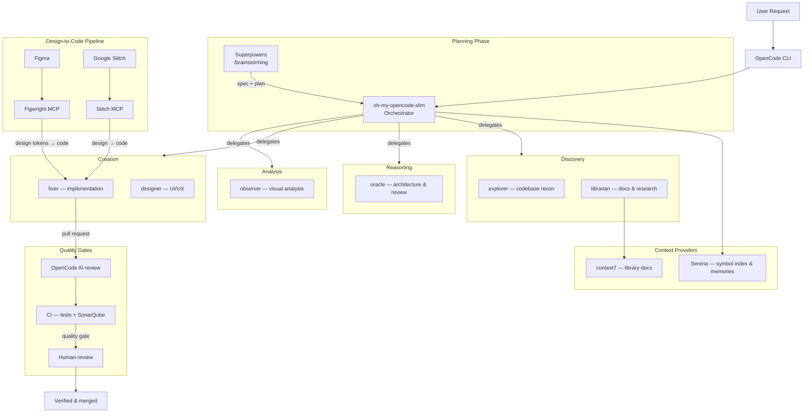

# AI-Assisted Software Engineering Workflow

This repository documents my AI-assisted software engineering workflow. I use [OpenCode](https://opencode.ai) as the primary development environment and a lightweight orchestration layer to delegate exploration, research, architecture, UI, implementation, and visual analysis to specialized agents. AI is heavily involved in development, but changes remain constrained by explicit planning, project context, automated tests, AI review, static analysis, and human approval. The goal is not autonomous coding, but a repeatable engineering system that increases development speed without removing engineering accountability.

This repository documents both the methodology and the technical configuration used to implement it.

## Scope

This repository documents my current AI-assisted development workflow and configuration. It is a living system rather than a prescriptive framework. Individual projects may use a subset of these agents, tools, models, or quality gates depending on their requirements, technology stack, security constraints, and delivery needs.

## Principles

This workflow treats AI as a **team of specialized engineering assistants** rather than a single autonomous coder:

- **AI is an engineering multiplier, not a replacement for engineering judgment.** AI is used heavily for exploration, research, implementation, testing, review, documentation, and repetitive work.
- **Human judgment remains responsible** for requirements, architecture, trade-offs, security-sensitive decisions, acceptance criteria, and final approval.
- **Significant changes are expected to pass through verification** — tests, AI review, static analysis — before they are considered complete.

## What This Workflow Optimizes For

- **Speed** — parallelize independent research and implementation tasks.
- **Context quality** — provide agents with project-specific code, memories, and current documentation.
- **Correctness** — use tests, static analysis, AI review, and human review rather than trusting generated output.
- **Maintainability** — preserve existing project components, patterns, and design systems.
- **Cost efficiency** — route tasks to models based on the complexity they actually require.
- **Reproducibility** — codify workflows, prompts, quality gates, and project instructions in version-controlled configuration.

## Workflow at a Glance

For the development setup to reproduce this workflow on a fresh machine, see [DEV-SETUP.md](DEV-SETUP.md).

## End-to-End Development Flow

1. **Understand** — the request is clarified (via `/brainstorming` for feature work, or directly for straightforward changes).
2. **Plan** — the orchestrator builds a dependency graph: what can run in parallel, what must be sequential, file ownership.
3. **Explore** — `explorer` maps the relevant parts of the codebase.
4. **Research** — `librarian` verifies current framework/API documentation (via context7 + gh_grep).
5. **Delegate** — independent lanes are dispatched to specialists in the background.
6. **Implement** — `fixer` executes well-scoped implementation tasks.
7. **Review** — OpenCode AI review.
8. **Verify** — CI tests + SonarQube quality gate.
9. **Approve & Ship** — human review, merge, deploy.

## AI Roles

| Agent | Responsibility |
|-------|----------------|
| **orchestrator** | Plans the dependency graph, dispatches background specialists, reconciles results |
| **explorer** | Fast codebase reconnaissance — locates files, symbols, and patterns |
| **librarian** | External knowledge — library docs, API references, GitHub examples (uses context7 + gh_grep) |
| **oracle** | Strategic advisor — architecture, complex debugging, code review |
| **designer** | UI/UX design and implementation |
| **fixer** | Bounded implementation — executes well-scoped tasks |
| **observer** | Visual analysis of images/PDFs/screenshots (read-only) |

## Human Responsibility

**AI assists with:** exploration, research, implementation, refactoring, testing, review, documentation.

**I remain responsible for:** requirements, architecture and trade-offs, security-sensitive decisions, business-logic correctness, acceptance criteria, final review, and merge.

## Context & Memory

- **Serena (MCP)** — project symbol index + persistent memories, so agents understand a repo without re-reading everything. Active in `portfolio-website`, `pprcv-poc`, `new-transformlit-webapp`, and this repo.
- **context7 (MCP)** — injects version-specific library documentation into the context window at query time, reducing hallucination risk against rapidly-changing APIs.

## Design-to-Code

Designs are translated to code through MCP bridges, with design systems kept authoritative:

- **Figma → Figwright MCP** — the Figwright bridge grounds generated code in the Figma file's actual design system: components, tokens, and icons are mapped to existing project code before anything is generated. Design systems are authored for AI to follow.
- **Google Stitch → Stitch MCP** — Stitch designs are translated into code via the Stitch MCP server, including design-system application across screens.

Both pipelines reuse the project's existing components and tokens rather than regenerating them.

## Quality Gates

- **OpenCode AI review** — an `anomalyco/opencode/github` action reviews configured pull requests for bugs and security issues, posting a review and failing the gate if actionable problems are found. Reference: [`.github/workflows/opencode-review.yml`](.github/workflows/opencode-review.yml).
- **Self-hosted SonarQube (Community edition)** on an Azure VM — see the [`sonarqube-code-analysis`](https://github.com/daryllmagsombol/sonarqube-code-analysis) repo for the deployment setup.
- **SonarQube GitHub Action** — runs `SonarSource/sonarqube-scan-action@v7`, waits for the SonarQube quality gate before the PR can be merged. Reference: [`.github/workflows/sonarqube.yml`](.github/workflows/sonarqube.yml).
- Quality-gate workflows are codified in project `AGENTS.md` files (e.g. `pprcv-poc`) and can be reused across repos.

## Security & Data Handling

- Models are routed through a mix of hosted providers, local gateways, and self-hosted tooling depending on the project.
- **Local / self-hosted infrastructure** includes `9router` (local model gateway), `oMLX` (local MLX provider), `headroom` (local model proxy), and the self-hosted SonarQube instance.
- **No secrets, credentials, or production keys are intentionally supplied to models.** Repository code may be processed by configured model providers and development tools; provider selection can be changed based on project confidentiality requirements, with local/self-hosted routing available for sensitive workloads.
- Client-specific data-handling requirements take precedence over the default configuration.
- Per-project `aws` MCP and `azure-*` skills keep cloud operations scoped and auditable.

## Example: Feature Development

### Example 1 — Blink Social ([blink-social-webapp](https://github.com/daryllmagsombol/blink-social-webapp))

An Instagram-like social platform (NestJS 11 + Next.js 15, PostgreSQL + Prisma, Turborepo/pnpm). A typical feature — say, adding a rate limiter to an API route — flows through:

1. **Request** — "add rate limiting to the posts API."
2. **Plan** — `/brainstorming` clarifies requirements and acceptance criteria.
3. **Explore** — `explorer` maps the existing auth/session and posts module architecture.
4. **Research** — `librarian` verifies the current NestJS rate-limiter API.
5. **Implement** — `fixer` adds the bounded change.
6. **Review** — the OpenCode AI PR reviewer flags a bug or security issue if one exists; the `gate` job blocks merge if bug keywords are found.
7. **Verify** — `pnpm typecheck` + SonarQube scan (quality gate) run in CI.
8. **Human** — I review the diff and security implications, then approve and merge.

Real history in this repo includes a rate-limiter bug found by the OpenCode AI PR reviewer, and a GraphQL migration from REST/WebSocket.

### Example 2 — PPCRV POC ([ppcrv-poc](https://github.com/daryllmagsombol/ppcrv-poc))

A cloud-agnostic Philippine election monitoring platform (Python + DuckDB ETL, NestJS API, Next.js web, Redis, Postgres). This project uses **superpowers Subagent-Driven Development** end-to-end:

1. **Plan** — the planner writes a task brief (e.g. `docs/superpowers/plans/2026-07-16-analytics-redis-serving-layer.md`).
2. **Brief** — a subagent gets a detailed brief with expected test commands and a commit step.
3. **Implement** — the subagent implements the task and reports status, files, test results, and commit SHA.
4. **Review** — a reviewer diff comes back clean; findings land in `.github/REVIEW_HISTORY.md` so the AI reviewer doesn't re-flag resolved issues.
5. **Verify** — SonarQube quality gate with >80% coverage target (mock-based unit tests in `__tests__/`).

This project also demonstrates the Sonar quality-gate loop: when a gate fails, the source is fixed **and** the detection rule + fix pattern is documented in `docs/sonar/sonar-guidelines.md` (e.g. "mark pool readonly" S2933, "node: prefix" S3723, coverage to 84%).

## Failure Handling

What happens when the AI gets it wrong:

- **Conflicting AI output** — independent agents are reconciled by the orchestrator; architectural conflicts are escalated to the oracle and/or human judgment.
- **Uncertain documentation** — `librarian` retrieves authoritative, current documentation and verifies against the project's actual dependencies rather than relying on model memory.
- **Failing tests** — a systematic-debugging cycle begins; root cause is investigated and changes are revalidated.
- **Quality-gate failure** — the PR does not merge; issues are fixed (with the Sonar detection rule + fix documented for future reference) and the pipeline re-runs.

## Tooling

| Tool | Purpose | Role in the flow |
|------|---------|------------------|
| **OpenCode CLI** | Terminal AI coding assistant | Hosts agents, skills, MCPs, and providers |
| **oh-my-opencode-slim** | Agent orchestration plugin for OpenCode | Routes tasks to specialist agents; runs on the `opencode-go` preset |
| **Superpowers** | Skills suite (planning, TDD, debugging, review) | `/brainstorming` and related skills for feature work and complex tasks |
| **Serena** (MCP) | Project symbol index + persistent memories | Agents understand a repo without reading everything; `.serena/` per project |
| **Stitch MCP** | Google Stitch design tool | Translates designs in Stitch into code |
| **Figwright MCP** | Figma design tool bridge | Translates Figma designs into code; design-system-aware |
| **Playwright MCP** | Browser automation & E2E | Runtime frontend verification — checks that built UI actually works |
| **GitHub MCP** | GitHub API bridge (official) | Issues, PRs, workflow runs, and code search in agent context |
| **context7** (MCP) | Version-specific library documentation | Injects current docs into the context window at query time |
| **SonarQube** (self-hosted) | Code quality & security analysis | Quality gate via GitHub Actions on pull requests |

> **Also in my stack (not covered in detail here):** `rtk` (token-optimizing bash proxy/plugin), `headroom` (local model proxy), `9router` (local model gateway), `oMLX` (local MLX provider), `graphify` (knowledge-graph skill), `azure-*` skills, and a per-project `aws` MCP.

## Model Routing

Models are selected by task characteristics rather than using one model for every operation.

Agent responsibilities are stable; model assignments are implementation details and may change independently.

| Agent | Selection priority |
|-------|--------------------|
| **orchestrator** | Reasoning + planning |
| **oracle** | Architecture / reasoning |
| **explorer** | Fast codebase comprehension |
| **librarian** | Fast retrieval / research |
| **designer** | Frontend / code generation |
| **fixer** | Reliable implementation |
| **observer** | Visual understanding |

### Configuration snapshot (updated August 2026)

Model assignments are experimental and may change as model quality, latency, and pricing evolve. The workflow is intentionally provider/model-agnostic — designed to remain useful even when models, providers, pricing, or tooling change. This section is intentionally volatile; the methodology and agent responsibilities are more stable than the model assignments. The active preset is **`opencode-go`**, backed by the [OpenCode Go](https://opencode.ai/docs/go/) subscription (flat $10/month, usage caps of $12/5h, $30/week, $60/month).

Per-agent model assignments (full multi-preset config in [`oh-my-opencode-slim.json`](oh-my-opencode-slim.json)):

| Agent | Model |
|-------|-------|
| **orchestrator** | `opencode/minimax-m3` (thinking) |
| **oracle** | `opencode/glm-5.2` (max) |
| **explorer** | `opencode/deepseek-v4-flash` (high) |
| **librarian** | `opencode/deepseek-v4-flash` (high) |
| **designer** | `opencode/kimi-k2.7-code` |
| **fixer** | `opencode/deepseek-v4-flash` (high) |
| **observer** | `opencode/mimo-v2.5` |

Other presets available: `opencode-zen-free`, `9router`, `openai`.

## Workflow Evolution

- **v1 — Heavy hierarchy.** A **Team Leader** primary agent delegated to PM / QA / Security / UI-UX subagents (documented in [`old-agents/README.md`](old-agents/README.md)).
- **v2 — Thin orchestration.** An orchestrator delegates to specialized, bounded agents (explorer, librarian, oracle, designer, fixer, observer).

**Why:** reduced coordination overhead, simplified responsibilities, and made delegation more predictable. The evolution demonstrates an experimentation-driven approach to multi-agent architecture rather than a static tool install.

## Appendix — Technical Configuration

- **Global config:** `~/.config/opencode/` — `opencode.json` (plugins, MCPs, providers) and `opencode.jsonc` (default agent `orchestrator`, small model `deepseek-v4-flash`, headroom provider).
- **Providers:** `9router` (local gateway at `localhost:20128`, ~40 models), `omlx` (local MLX at `127.0.0.1:8000`), `headroom` (Claude/GPT via local proxy).
- **Skills:** superpowers + custom design skills (`ui-ux-pro-max`, `brand`, `design-system`, `slides`, `figma-build`, `figma-codegen`) and cloud skills (`azure-*`).
- **Plugins:** `rtk` rewrites bash commands through `rtk` for token savings.
- **Reference workflows:** [`.github/workflows/opencode-review.yml`](.github/workflows/opencode-review.yml) and [`.github/workflows/sonarqube.yml`](.github/workflows/sonarqube.yml), reused across projects for further refinement.

## License

MIT
